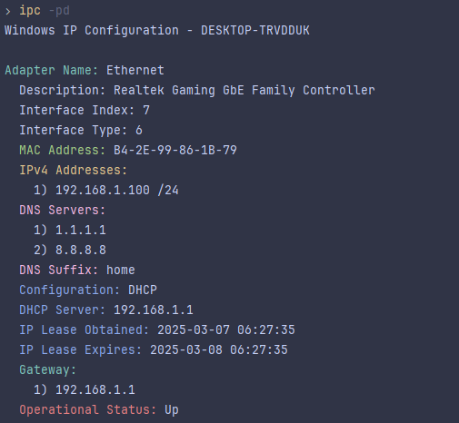

# Windows IP Configuration Tool (ipc)

This is a Windows IP configuration tool written in C, providing Linux-like `ip` command features. It displays network adapter information, including IP addresses, MAC addresses, DNS servers, and more.



## Features

* **Adapter Information:** Displays detailed information about network adapters, including name, description, MAC address, IP addresses (IPv4 and IPv6), DNS servers, and gateway addresses.
* **Filtering:** Options to show all adapters (including disconnected ones), or filter by IPv4 or IPv6 addresses.
* **Output Formatting:** Supports brief and detailed output formats.
* **DNS Information:** Shows DNS servers and suffixes for each adapter.
* **DHCP Information:** Displays DHCP configuration status, server information, and lease times.
* **Routing Table:** Displays the system's routing table.
* **Network Statistics:** Shows network statistics.

## Usage

```
ipc [OPTIONS]
```

### Options

* `-a`, `--all`: Show all adapters (including disconnected ones).
* `-4`, `--ipv4`: Show only IPv4 addresses.
* `-6`, `--ipv6`: Show only IPv6 addresses.
* `-b`, `--brief`: Brief output format.
* `-d`, `--details`: Show detailed information.
* `-h`, `--help`: Display this help message.
* `-n`, `--no-dns`: Don't show DNS information.
* `-r`, `--route`: Show routing table.
* `-s`, `--stats`: Show network statistics.
* `-g`, `--global`: Show global IP addresses.
* `-p`, `--only-physical`: Show only physical addresses.
* `-c`, `--connections`: Show active connections.
* `-i`, `--hide`: Hide sensitive information like Public IP.
* ⠀⠀⠀⠀⠀⠀`--release`: Release DHCP lease.
* ⠀⠀⠀⠀⠀⠀`--renew`: Renew DHCP lease.
* ⠀⠀⠀⠀⠀⠀`--flush`: Flush DNS cache.

### Examples

* Show all adapters with detailed information:

    ```
    ipc -ad
    ```

* Show only IPv4 addresses in brief format:

    ```
    ipc -4 -b
    ```

* Show the routing table:

    ```
    ipc -r
    ```

## Project Structure

The project is organized into modular components:

* **Core:** Contains the adapter information retrieval functions
* **Display:** Handles the formatting and display of network information
* **Main:** Program entry point and command-line argument processing

## Compilation

To compile this program, you will need a C compiler (like GCC) and the Windows SDK:

1. **Install MinGW:** Download and install MinGW (Minimalist GNU for Windows) with `gcc` and `make` tools.

2. **Build with make:** Run the following command:

    ```bash
    make
    ```

3. **Run:** After successful compilation, you can run the program:

    ```bash
    ipc
    ```

## Dependencies

* Windows SDK (for header files like `windows.h`, `winsock2.h`, `ws2tcpip.h`, `iphlpapi.h`)
* MinGW (or another GCC distribution for Windows)

## Notes

* This tool requires administrator privileges for certain operations.